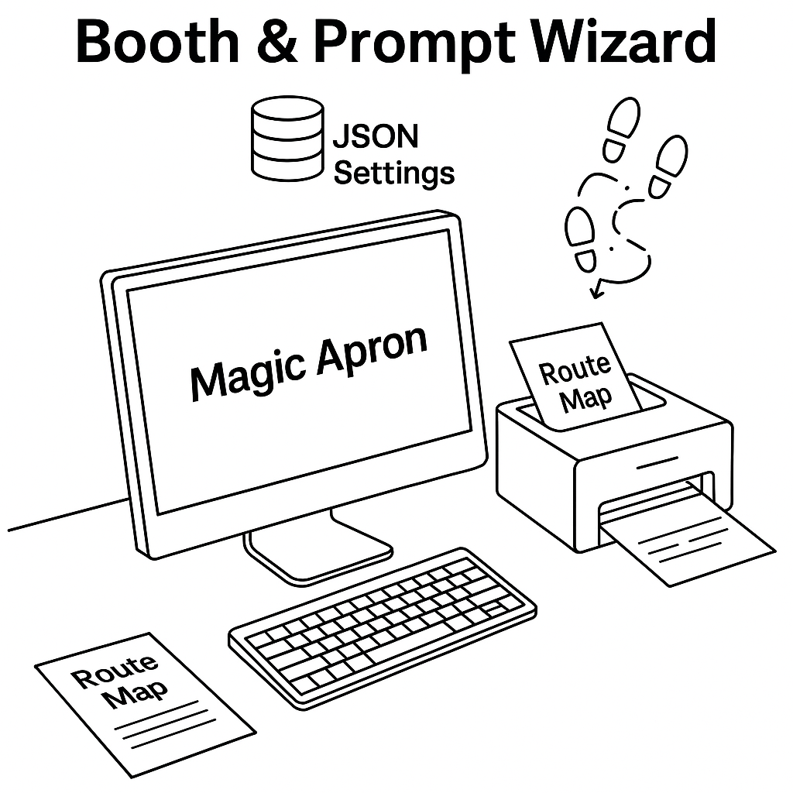

# Magic Apron Booth Trial in Store 8949

## Store 8949 Needs

**1. to provide Assoc with better Message tools**

  - Every month, Assocs spend 2,000+ hrs on floor service.

  - Current GET method = loose, unstructured.

  - Need new tools → enable Assocs to deliver precise, high-impact messages, used together with GET practice.

**2. to prep Assoc for future workplace AI deploy**

  - Many Assocs feel anxious about AI's role in the workplace.

  - Must show that AI is here to support their work, not replace it.

  - To build trust, program should be driven by *SMs and Assocs*, not just the Corporate.


##  Magic Apron TB & Localized Prompt Wizard

Magic Apron, HomeDepot's LLM, opens up new possiblities...

```
Core to this proposal is to create effective prompts for use with Magic Apron, and then convert the AI’s output into a Route Map format.
```


<br>
<br>


## Loc: Entrance, Next to D31
- start of customer experience trip in the store, operated by Assoc
- **Features:**  
  - Touchscreen + Keyboard + WiFi Guest
  - Local printer (for printing Route Map)
  - Pilot stage: codes and .env in local, physical lockup when not in use, subject to remote lockup too


## Input: by D31 Assoc
```
Assoc: 

“Hi there. Want to see how our AI can map out the best solution for your project—right here in the store?”

```
<br>
<br>

## Setting (per the Store Manager's direction)
- **Key Settings:**  
  1. Store weekly push  
  2. Local building codes  
  3. Local weather profile (e.g., wildfire warnings).  
  4. Up-engagement strategies
 
example **Store_Setting.json**
```
{
  "store_id": "8949",
  "zip": "92064",
  "1. "store_weekly_push": [
    {"sku": "100123456", "name": "Pressure-Treated Wood Post 4x4x8"},
    {"sku": "100456789", "name": "RYOBI 18V ONE+ Cordless Drill/Driver Kit"},
    {"sku": "100567890", "name": "Westinghouse 9500DF Dual Fuel Portable Generator"},
    {"sku": "100678901", "name": "Toshiba 12000 BTU Portable Air Conditioner"}
  ],
  "2. local_weather": {
    "condition": "hot_dry, wildfire hazard",
    "recommendations": [
      "Use outdoor-rated adhesives and corrosion-resistant fasteners",
      "Apply UV-resistant exterior stain to prolong material life",
      "Maintain defensible space by clearing vegetation near fence line",
      "Select ignition-resistant or treated lumber where feasible",
      "Avoid storing flammable materials adjacent to structures"
    ]
  },
  "3. building_codes": {
    "fence_rules": "Masonry or wood fences 6 ft or less do not require a building permit; however, clear 2-ft access to water meters and no encroachment in utility easements. (Per Poway standard plan & PMC 13.11.130.A) :contentReference[oaicite:1]{index=1}",
    "wui_requirements": "Fences in high fire risk zones must comply with Wildland-Urban Interface Code—PMC 15.24.100. :contentReference[oaicite:2]{index=2}",
    "zoning": "Fence heights regulated under PMC 17.08; front yard height rules per Title 17.08.240. :contentReference[oaicite:3]{index=3}"
  },
  "4. up_engagements": [
  "Need a list of trusted landscapers for your backyard?",
  "Thinking about adding solar lighting or panels out back?",
  "Want ideas to pair your fence with landscaping or solar upgrades?"
]
}

```

<br>
<br>

*(mockup for discussion, to save time in this first meeting)*

## Wizard Input ##

  - Support Assocs in creating optimized text prompts for Magic Apron—powered by a reasoning-ready LLM (e.g., GPT-5).

  - Chrome Extension or API access ?

  - Step-by-step user workflow.


## Response Justification ##

  - Captures Magic Apron’s text output.

  - Pulls context from store.json to explain the “why” behind recommendations and provide justifications.

## Shelf_Loc + Route Map ##

  - Pull from store inventory list with shelf_loc information (aisle + bay locations).

  - Organizes results into a logical route plan.

  - Formats per below examples.

**Route Map Examples:**  
- [Example 1: Fence Replacement](RouteMap_FenceReplace.md)  
- [Example 2: Deck New Build](RouteMap_DeckBuild.md)


## 📝 Action and Deliverables 
*(mockup for discussion, to save time in this first meeting)*

| Action Item                   | Stage | filled by Corp                  | filled by Store 8949                 | Work Schedule |
|--------------------------------|-------|---------------------------------|--------------------------------------|---------------|
| Program SOW w/ Eval Metrics    | Prep  | --                              | Provide a comprehensive plan         | 2–3 weeks     |
| Hardware (PC, printer, stand)  | Prep  | --                              | Yes (will seek Regional support)     | 1 week        |
| Wizard Input Module            | Dev   | Architecture + code works       | Design UI & user workflow            | 2 weeks       |
| Resp_Justification Module      | Dev   | Architecture + code works       | Test + Local install                 | 2 weeks       |
| Shelf_Loc + RouteMap Module    | Dev   | Architecture + code works       | Output format                        | 2 weeks       |
| Pilot Run                      | Depl  | --                              | Run + gather feedback                | 4 months      |


<br>
<br>

## 👤 Simon Chen — User Onboarding (UO) Program Specialist  


career focus: Customer Engagement SaaS | UO Strategy

**Clients:** Pfizer, Roche, J&J, Eisai-Biogen  
current: Store Associate, Poway Store 8949

📞 (858) 733-1029  
📧 presenter.simon@gmail.com  
🔗 [LinkedIn](https://www.linkedin.com/in/hsienchen/) 

<br>
<br>
<br>

## 🎯 Past UO Works

🔗 [client projects](past_UO_cases.md)  


