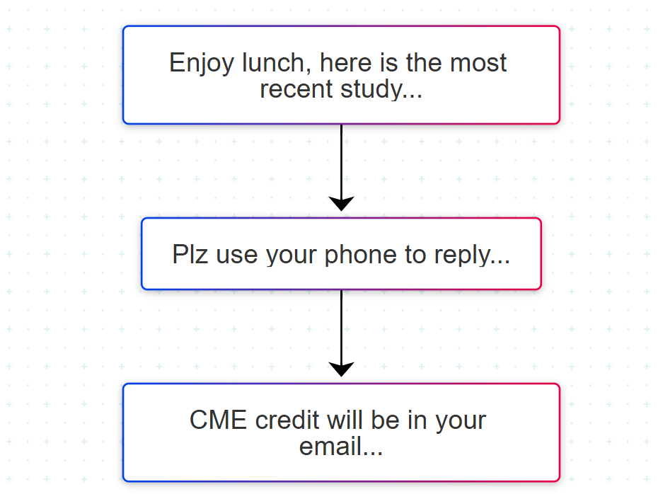

**Career Focus**  
- Physician Engagement (incl. CME)  
- Patient Awareness  
- Sales Rep Coaching (SFE)

---

## DFC Website – Patient Recruitment  
**Client:** Eisai Pharma  
**Focus:** `#Disease Awareness#` & `#AD Registry#`  
🔗 [DFC Global Reference (2017)](https://www.alzint.org/u/dfc-developments.pdf)

A digital referral and appointment platform supporting the **Dementia Friendly Community (DFC)** initiative and China’s **NGI campaign**.

- Integrated with pharma workflows and symbolic wristbands  
- Over **300,000 registered DFC members**  
- Recognized as a **2017 Best Practice Innovation** under the global DFC initiative
- Technology platform: WeChat Official Account, WeChat.js API, SMS gateway, Alibaba Cloud ECS & RDS


---


## Lunch Bag CME – Physician Engagement

**Clients**: Pfizer China, Roche China, Sanofi-Aventis China
**Focus**: #Physician Enga# & #Continuing Med Edu# #Saleforce Effec

### Customer’s Challenges ###

-Scattered target base and large sales force (e.g., Lipitor: 200K target doctors, 1,500 reps)

-Shift toward **evidence-based medicine** → need for precision messaging

-**LunchBag** positioned as a cost-effective alternative to Symposium

**Technology constraints**: 
no iPhones, pre-3G era, limited connectivity (SMS only), no cloud, modem connection to private server


**Our Solution--Rep’s Workflow**

-SMS check-in – Rep receives a Meeting ID.

-Play Video, and Prompt for Physician's Feedback

-Physician Send SMS with the Meeting ID.



```
Activities officially accredited by China’
```

The project received rave reviews from Big Pharmas. 

### Pfizer ###
 continued to place order from 2008 through 2010.


### Roche ###
 remained an active client for similiar initiatives.


...
[🔙 Return to Home](./README.md#career-references)
---