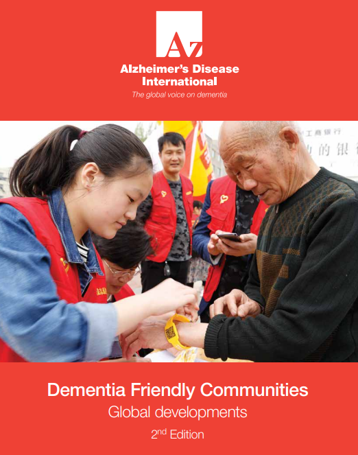
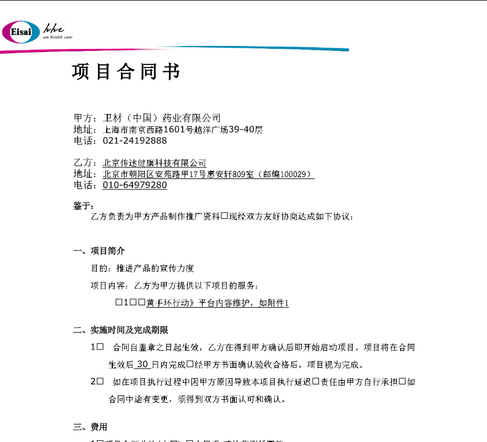
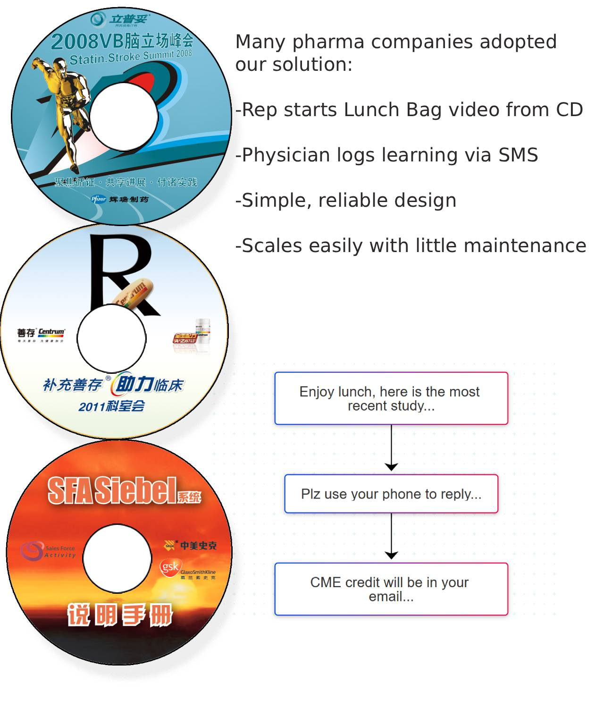
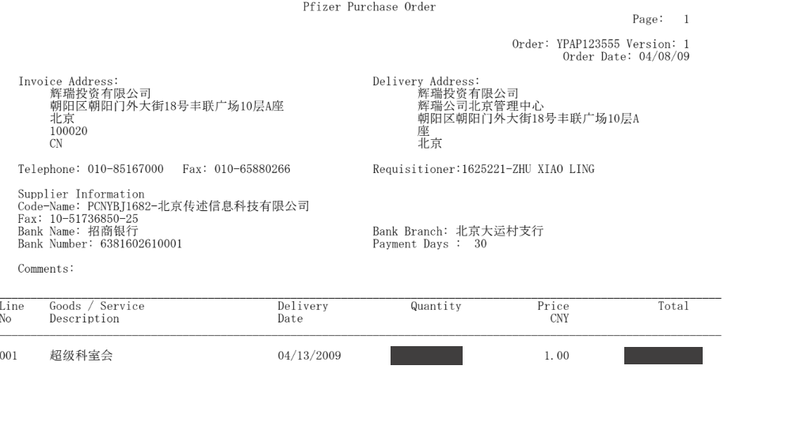
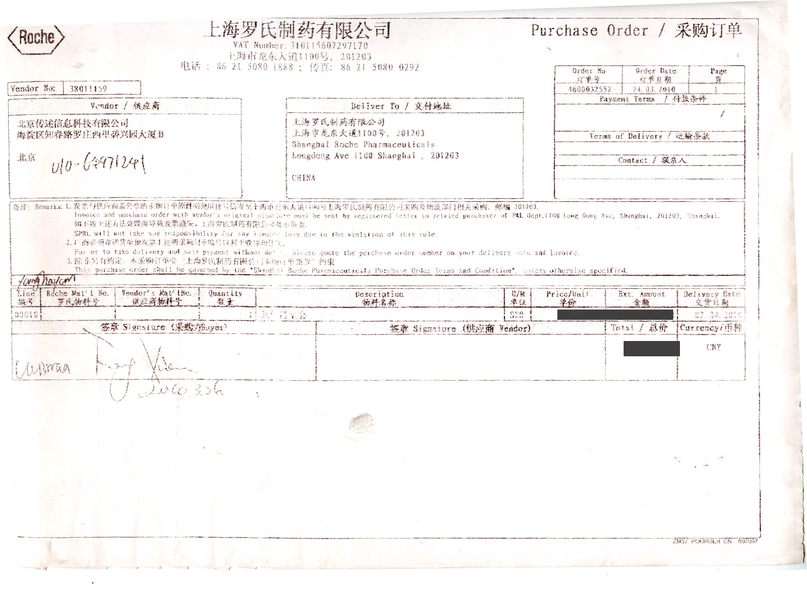

<style>
/* Only affects code blocks you tag with .code-narrow */
.code-narrow .highlight pre,
.code-narrow pre {
  max-width: 680px;        /* set the width you want */
  white-space: pre-wrap;   /* wrap long lines */
  word-break: break-word;  /* break long words if needed */
  overflow-x: hidden;      /* remove the horizontal scrollbar */
}
</style>


# Past Projects

**Career Focus**  
- Physician Engagement (incl. CME)  
- Patient Awareness  
- Sales Rep Coaching (SFE)

---

## DFC Website – Patient Recruitment  
**Client:** Eisai Pharma  
**Focus:** `#Disease Awareness#` & `#AD Registry#`  
🔗 [DFC Global Reference (2017)](https://www.alzint.org/u/dfc-developments.pdf)

An AD prevention-awareness campaign and a NGO referral platform supporting the **Dementia Friendly Community (DFC)** initiative.

- Essential to the program: QR coded wristbands  
- Over **300,000 registered DFC members**  
- Recognized as a **2017 Best Practice Innovation** under the global DFC initiative
- Technology platform: WeChat Official Account, WeChat.js API, SMS gateway, Alibaba Cloud ECS & RDS

<br>

    In China, direct-to-patient (D2P) outreach is prohibited, and NGO activities are closely monitored.


---
    To secure approval, we positioned the campaign under the Dementia Friendly Community (DFC) theme.




    Eisai, a Japanese company, partner with us for 10 years (2012-2021). During the period, Aircept remained the leading prescription drug for AD and MCI (mild cog impaired) patients in China  



## Lunch Bag CME – Physician Engagement

**Clients**: Pfizer, Roche, GSK, Merk (aka MSD), Novartis, and almost all Big Pharmas in China

**Focus**: 
    #Physician Enga# &  #Continuing Med Edu# 
    #Saleforce Effec#

### Customer’s Challenges ###

    -Scattered target base and large sales force (e.g., Lipitor: 200K target doctors, 1,500 reps)

    -Shift toward **evidence-based medicine** → need for precision messaging

    -**LunchBag** positioned as a cost-effective alternative to ,medical symposium

    -In need of an activities Life-Cycle management system


**Technology constraints**: 

    before iPhone era, pre 3G mobility, limited connectivity (SMS only), no cloud infrastructure, no streaming video, modem connection to private servers (running Windows NT)


**Our Solution--Rep’s Workflow** (easy to operate)

    -SMS check-in – Rep receives a Meeting ID.

    -Play Video, and Prompt for Physician's Feedback

    -Physician Send SMS with the Meeting ID.




## Stack Overview

**Laptop (Rep in the Field)**
```
Auto-start via .bat from CD/DVD
Simple media control interface
Windows Media Player SDK + Visual Basic
Video timeline synced with JPG slide prompts
```

**NT Server**

```
Multiple COM ports, each with a connected modem
Lightweight storage in Access or MySQL for incoming SMS
Auto-export to Excel for client reports
```


The project received rave reviews from Big Pharmas. Simple and robust overall. Scaled to heavy use over long period, with very few downtime and minimal IT support.

### Pfizer ###
 continued to place order from 2008 through 2010.



### Roche ###
 remained an active client for similiar initiatives.


...
[🔙 Return to Home](./README.md#career-references)
---